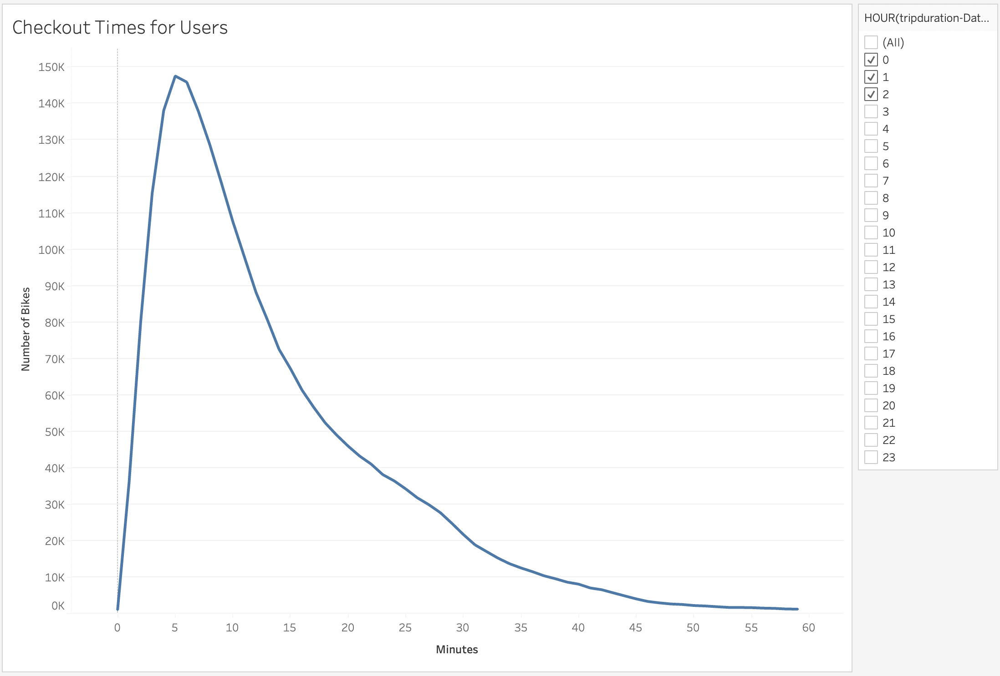
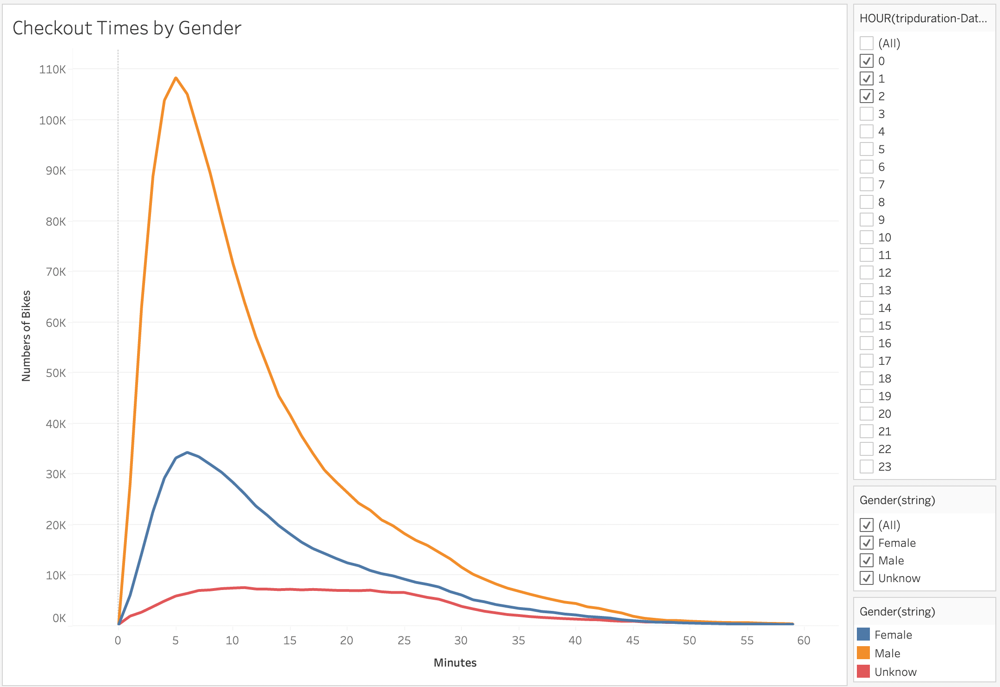
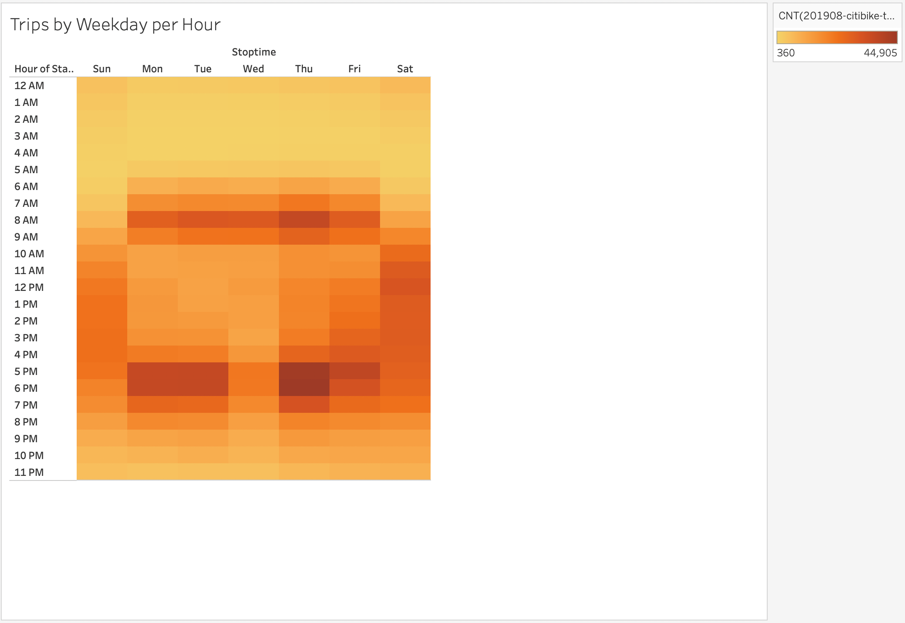
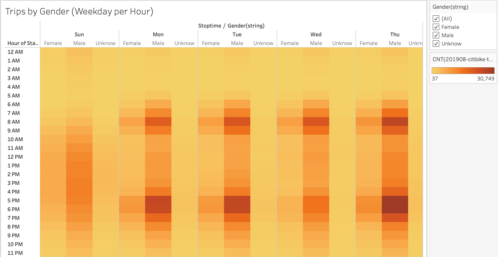
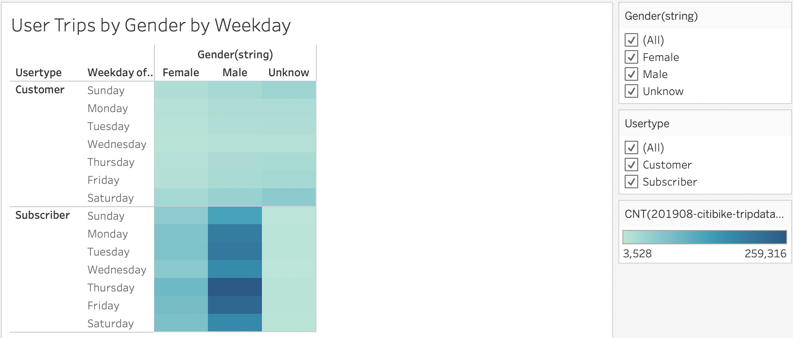
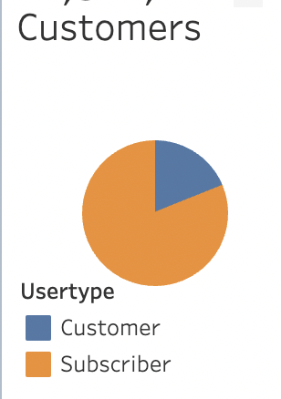
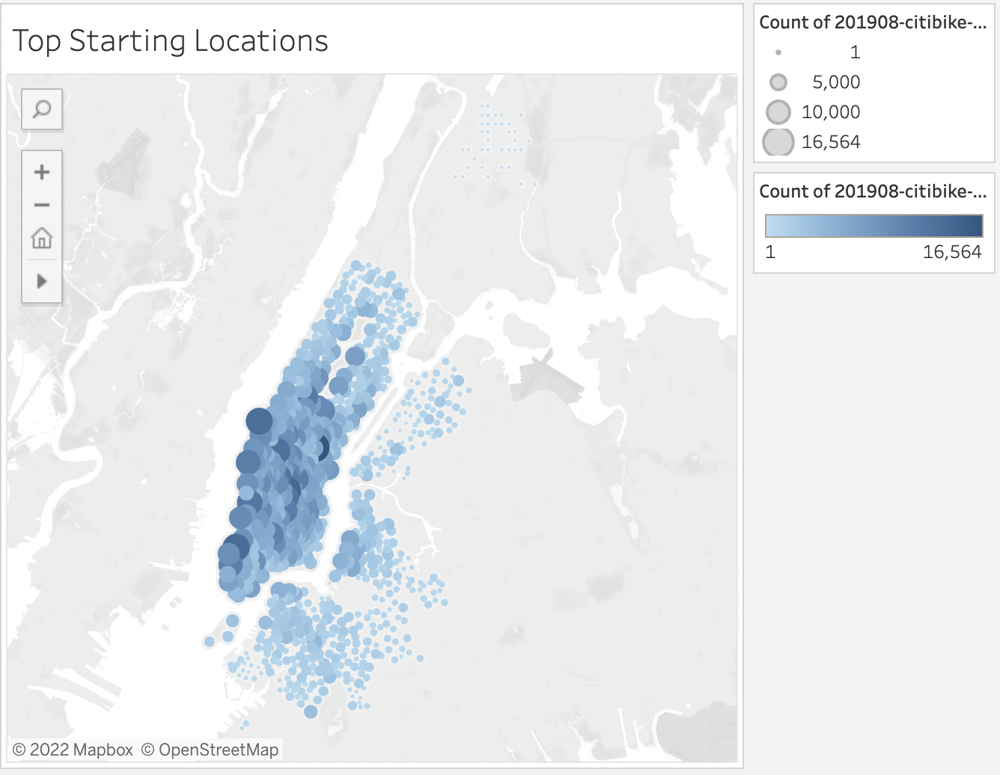

# bikesharing

## Overview of Project 

The purpose of this project is to an analysis of New York Citi Bike Data, using the data visualization tool [Tableau Public](https://www.tableau.com/) for an investors presentation aimed at starting a bikeshare program in Des Moines, Iowa. The analysis uses data from August 2019 that is publicly available on the NYC CitiBike program [archives](https://s3.amazonaws.com/tripdata/index.html). 

---

## Resource: 

Data Sources: 201908-citibike-tripdata.csv, 201908-citibike-tripdata-revised.csv 

Tools: Visual Studio Code, Tableau Public, Python, Pandas, Jupyter Notebook. 
 
---

## Results: 

[Link to Dashboard]( https://public.tableau.com/app/profile/caitlin.bishop/viz/dev3_bikesharing_challenge_story/bikesharing_challenge_story_dev3#1) 

Based on the visualizations below, the duration of most trips was under 10 minutes. Bikes located highly concentrated business areas (Midtown and Downtown) make up the majority of the usages, with subscribers being the main user. 

**Checkout Times for Users** 

 

Nearly all the trips (99%) were under an hour (60 minutes), with 49% under 10 minutes. 

**Checkout Times by Gender** 

 

Male riders make up 65% of the bikeshare program, with females representing 25% and the remaining 10% being unknown.  

**Trips by Weekday for Each Hour (Heat Map)** 

 

Majority of the weekdays (M-F) rides occur during commuting hours of 8-9am and 5-7pm. It appears the bikesharing program is the favored way for commuting to and from work. 

**Trips by Gender (Weekday per Hour)** 
 

Most users are male riders, they are more disposed to use the bikeshare program for commuting for work and during the weekends.  

**Trips by Gender by Weekday** 
 

Non-subscribers’ usage occurred most on Saturdays, with the highest usage day among subscribers on Thursday.  

**Customers Usertype**

 

Subscribers make up 81% of the customers (riders), which means the business will be based on residents rather than tourism. 

**Top Starting Locations**

 

The bikes located in business areas had higher usage compared to other locations. 

---

## Summary: 

Launching a bikeshare program in Des Moines, IA seems to be a sound business venture, if the bikeshare program in implemented in densely populated areas where parking is deficient and public transportation is widely used. Adding additional analysis is recommend:
* Comparing data from different month to determine trends across the year.
* Adding weather data to find correlation between weather and rides.
* Analyzing other cities that might be a better match to the size, population, and traffic pattern od Des Moines, IA. 

---
